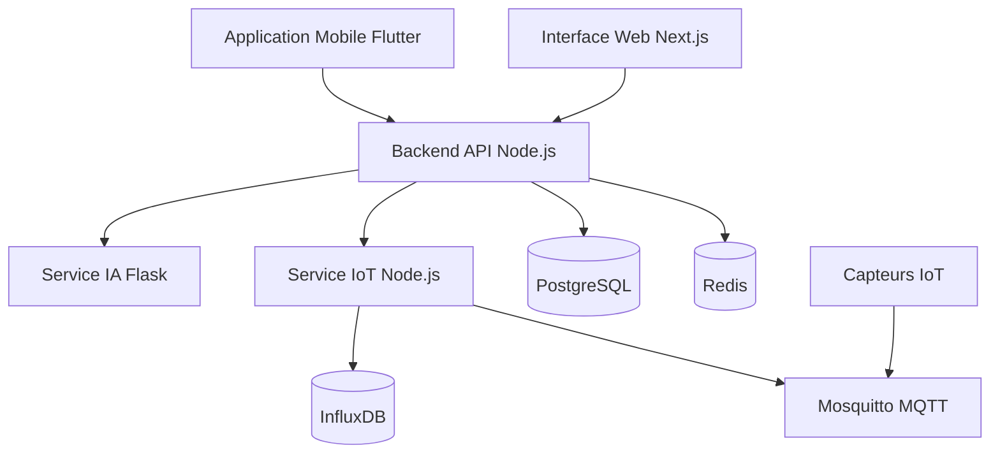

# 📖 AgriSmart CI - Documentation Technique

## Table des Matières

1. [Architecture Globale](#architecture-globale)
2. [Services](#services)
3. [Base de Données](#base-de-données)
4. [API REST](#api-rest)
5. [Authentification](#authentification)
6. [IoT & Capteurs](#iot--capteurs)
7. [Déploiement](#déploiement)

## Architecture Globale

AgriSmart CI est une architecture microservices modulaire :



## Services

### Backend API (Port 3000)

**Stack** : Node.js 20, Express, Socket.IO

**Responsabilités** :

- API REST pour toutes les fonctionnalités
- Authentification JWT
- WebSocket pour notifications temps réel
- Orchestration des autres services

**Endpoints principaux** :

- `/api/v1/auth/*` - Authentification
- `/api/v1/parcelles/*` - Gestion parcelles
- `/api/v1/capteurs/*` - Gestion capteurs
- `/api/v1/alertes/*` - Système d'alertes
- `/api/v1/marketplace/*` - Marketplace

### Frontend Web (Port 3001)

**Stack** : Next.js 14, React, TailwindCSS

**Pages** :

- Dashboard agriculteur
- Gestion des parcelles
- Visualisation des données
- Administration (admin/conseiller)
- Marketplace
- Formations

### Service IA (Port 5001)

**Stack** : Python 3.10, Flask, TensorFlow

**Fonctionnalités** :

- Détection de maladies (images)
- Prédiction d'irrigation (ML)

### Service IoT (Port 4000)

**Stack** : Node.js, MQTT, InfluxDB

**Responsabilités** :

- Réception données capteurs via MQTT
- Stockage time-series dans InfluxDB
- Agrégation et calculs
- Déclenchement d'alertes

## Base de Données

### PostgreSQL - Données Principales

**Tables principales** :

```sql
users                 -- Utilisateurs (agriculteurs, conseillers, admin)
parcelles            -- Parcelles agricoles
cultures             -- Référentiel des cultures
plantations          -- Cultures plantées sur parcelles
stations             -- Stations IoT
capteurs             -- Capteurs individuels
alertes              -- Alertes système
recommandations      -- Recommandations IA
maladies             -- Référentiel maladies
detections_maladies  -- Détections par IA
marketplace_produits -- Produits marketplace
formations           -- Contenus formation
```

**Enums** :

```sql
CREATE TYPE user_role AS ENUM ('producteur', 'conseiller', 'admin', 'partenaire');
CREATE TYPE sensor_type AS ENUM ('humidite', 'temperature', 'ph', 'npk', 'meteo', 'camera');
CREATE TYPE alert_level AS ENUM ('info', 'important', 'critique');
CREATE TYPE alert_status AS ENUM ('nouvelle', 'lue', 'traitee', 'ignoree');
```

### Redis - Cache & Sessions

**Utilisation** :

- Sessions utilisateurs
- JWT refresh tokens
- Cache des requêtes fréquentes
- Rate limiting

### InfluxDB - Données Time-Series

**Measurement** : `sensor_data`

**Tags** :

- `station_id`
- `capteur_id`
- `parcelle_id`
- `type` (humidite, temperature, etc.)

**Fields** :

- `value` : valeur mesurée
- `quality` : qualité du signal

## API REST

### Authentification

#### Inscription

```http
POST /api/v1/auth/register
Content-Type: application/json

{
  "telephone": "+2250700000001",
  "password": "Password123!",
  "nom": "Kouassi",
  "prenoms": "Jean",
  "langue_preferee": "fr"
}
```

**Réponse (Dev)** :

```json
{
  "success": true,
  "message": "Compte créé avec succès!",
  "data": {
    "user": { ... },
    "token": "eyJhbG...",
    "refreshToken": "eyJhbG..."
  }
}
```

**Réponse (Prod)** :

```json
{
  "success": true,
  "message": "Code OTP envoyé par SMS",
  "data": {
    "requiresOtp": true,
    "user": { ... }
  }
}
```

#### Connexion

```http
POST /api/v1/auth/login
Content-Type: application/json

{
  "identifier": "0700000001",
  "password": "password123"
}
```

**Headers requis pour les routes protégées** :

```
Authorization: Bearer <token>
```

### Parcelles

```http
# Lister mes parcelles
GET /api/v1/parcelles

# Créer une parcelle
POST /api/v1/parcelles
{
  "nom": "Parcelle Nord",
  "superficie_hectares": 2.5,
  "latitude": 6.8270,
  "longitude": -5.2893,
  "type_sol": "argileux"
}

# Détail parcelle
GET /api/v1/parcelles/:id

# Mettre à jour
PUT /api/v1/parcelles/:id

# Supprimer
DELETE /api/v1/parcelles/:id
```

### Alertes

```http
# Lister toutes mes alertes
GET /api/v1/alertes

# Alertes non lues uniquement
GET /api/v1/alertes/unread

# Marquer comme lue
PUT /api/v1/alertes/:id/read

# Marquer toutes comme lues
POST /api/v1/alertes/read-all
```

## Authentification

### JWT Tokens

**Access Token** :

- Durée : 7 jours (configurable)
- Contenu : `{ userId, role }`
- Usage : Header `Authorization: Bearer <token>`

**Refresh Token** :

- Durée : 30 jours
- Stockage : Redis
- Usage : Renouveler l'access token

### OTP (Production)

- Envoi par SMS via Twilio
- Code à 6 chiffres
- Expiration : 10 minutes
- Max tentatives : 3

### Rôles & Permissions

```javascript
ROLES = {
  PRODUCTEUR: 'producteur',     // Agriculteur
  CONSEILLER: 'conseiller',      // Conseiller agricole
  ADMIN: 'admin',                // Administrateur
  SUPER_ADMIN: 'super_admin',    // Super admin
  PARTENAIRE: 'partenaire'       // Partenaire marketplace
}
```

## IoT & Capteurs

### Architecture MQTT

```
Capteurs → MQTT Broker (Mosquitto) → IoT Service → InfluxDB
                                    ↓
                              Backend API (alertes)
```

### Topics MQTT

```
agrismart/{station_id}/up           # Uplink (capteur → serveur)
agrismart/{station_id}/down         # Downlink (serveur → capteur)
agrismart/{station_id}/status       # Status capteur
```

### Format Message

```json
{
  "station_id": "STATION_001",
  "capteur_id": "SENSOR_TEMP_01",
  "type": "temperature",
  "value": 28.5,
  "unit": "celsius",
  "timestamp": "2024-12-09T10:30:00Z",
  "battery": 85,
  "signal": -72
}
```

### Seuils d'Alerte

Configurables par parcelle :

```javascript
{
  humidity: {
    criticalLow: 20,    // Sec critique
    warningLow: 30,     // Sec
    warningHigh: 80,    // Humide
    criticalHigh: 90    // Trop humide
  },
  temperature: {
    criticalLow: 10,
    warningLow: 15,
    warningHigh: 40,
    criticalHigh: 45
  },
  ph: {
    criticalLow: 4.5,
    warningLow: 5.5,
    warningHigh: 7.5,
    criticalHigh: 8.5
  }
}
```

## Déploiement

### Docker Compose (Développement)

```bash
# Lancer tous les services
docker-compose up -d

# Vérifier l'état
docker-compose ps

# Logs
docker-compose logs -f

# Stopper
docker-compose down
```

### Services

| Service | Container | Health Check |
|---------|-----------|--------------|
| Backend | agrismart_api | `/api/v1/health` |
| Frontend | agrismart_frontend | - |
| AI Service | agrismart_ai | `/health` |
| IoT Service | agrismart_iot | `/health` |
| PostgreSQL | agrismart_postgres | pg_isready |
| Redis | agrismart_redis | redis-cli ping |
| InfluxDB | agrismart_influxdb | `/health` |
| Mosquitto | agrismart_mosquitto | - |

### Variables d'Environnement

**Backend (`backend/.env`)** :

```env
NODE_ENV=development
PORT=3000
DB_HOST=postgres
DB_PORT=5432
DB_NAME=agrismart_ci
DB_USER=agrismart
DB_PASSWORD=password
REDIS_HOST=redis
REDIS_PORT=6379
JWT_SECRET=your-secret-key
```

**Frontend (`frontend/.env.local`)** :

```env
NEXT_PUBLIC_API_URL=http://localhost:3000/api/v1
NEXT_PUBLIC_SOCKET_URL=http://localhost:3000
NEXT_PUBLIC_AI_SERVICE_URL=http://localhost:5001
```

### Production

```bash
# Build optimisé
docker-compose -f docker-compose.prod.yml build

# Déploiement
docker-compose -f docker-compose.prod.yml up -d
```

**Checklist Production** :

- [ ] Changer tous les secrets/mots de passe
- [ ] Activer SSL/TLS (Nginx/Traefik)
- [ ] Configurer Twilio pour OTP
- [ ] Configurer SMTP pour emails
- [ ] Sauvegardes automatiques PostgreSQL
- [ ] Monitoring (Prometheus + Grafana)
- [ ] Logs centralisés (ELK Stack)

## 🔐 Sécurité

### Backend

- ✅ Helmet.js pour headers sécurisés
- ✅ Rate limiting (100 req/15min par IP)
- ✅ Validation des données (express-validator)
- ✅ Sanitization des inputs
- ✅ CORS configuré
- ✅ Bcrypt (12 rounds) pour mots de passe
- ✅ JWT avec expiration
- ✅ Refresh tokens révocables

### Base de Données

- ✅ Parameterized queries (protection SQL injection)
- ✅ Utilisateur DB avec droits limités
- ✅ Backups chiffrés
- ✅ SSL/TLS pour connexions

### API

- ✅ HTTPS en production
- ✅ API keys pour services externes
- ✅ Validation stricte des UUIDs
- ✅ Logs d'audit pour actions sensibles

## 📊 Monitoring

### Métriques à Surveiller

**Backend** :

- Temps de réponse API
- Taux d'erreurs
- Utilisation CPU/RAM
- Connexions DB actives

**IoT** :

- Messages MQTT/seconde
- Latence mesures
- Taux de perte de messages
- Santé capteurs

**IA** :

- Temps de prédiction
- Précision modèles
- Utilisation GPU

### Logs

```bash
# Backend
docker logs agrismart_api --tail 100 -f

# Rechercher erreurs
docker logs agrismart_api 2>&1 | grep ERROR

# Export logs
docker logs agrismart_api > backend.log
```

## 🆘 Dépannage

### Le backend ne répond pas

```bash
# 1. Vérifier que le container tourne
docker-compose ps api

# 2. Voir les logs
docker logs agrismart_api --tail 50

# 3. Vérifier PostgreSQL
docker exec agrismart_postgres pg_isready

# 4. Redémarrer
docker-compose restart api
```

### Erreurs de connexion DB

```bash
# Vérifier réseau Docker
docker network ls
docker network inspect agriculture_default

# Tester connexion
docker exec agrismart_api ping postgres
```

### Service IA lent

- Augmenter workers Gunicorn
- Activer GPU si disponible
- Réduire taille images envoyées

## 📚 Ressources

- [Documentation API complète](https://docs.agrismart.ci/api)
- [Guide développeur](https://docs.agrismart.ci/dev)
- [Tutoriels vidéo](https://youtube.com/agrismart)
